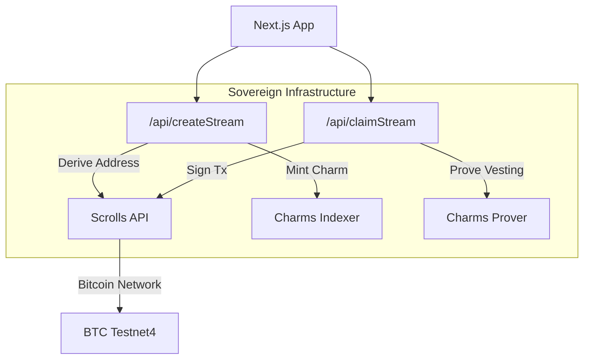

# Sovereign BTC Streams

Sovereign BTC Streams is a Next.js DApp that demonstrates **vault-backed BTC streaming** using **Charms** (ZK Logic) and **Scrolls** (Programmable Vaults).

This architecture allows for **Sovereign** streams, where funds are held in a vault that enforces off-chain vesting logic via on-chain Zero-Knowledge Proofs, rather than relying on a trusted custodian.

---

## Architecture



### Core Components
- **Charms**: Provides the "Spell" logic (vesting schedules) and Prover API (`https://v8.charms.dev`).
- **Scrolls**: Acts as the Programmable Vault (`https://scrolls.charms.dev`). It derives deterministic addresses and only signs transactions that carry valid Spells/Proofs.
- **Prisma + PostgreSQL**: Persists stream metadata locally for specific application needs.

---

## Stack
- **Frontend**: Next.js 14, Chakra UI, React 18
- **Backend**: Next.js API Routes, Prisma ORM
- **Database**: PostgreSQL 15
- **Bitcoin**: `@sats-connect/core` (Xverse Wallet), `bitcoinjs-lib`
- **Integrations**: Charms Prover API, Scrolls Bitcoin API

---

## 🚀 Quick Start

See **[SETUP.md](./SETUP.md)** for detailed setup instructions.

### 🎬 Hackathon Demo Setup

For a quick demo setup, see **[DEMO_GUIDE.md](./DEMO_GUIDE.md)** which includes:
- Step-by-step demo flow matching the 2-minute narration
- Pre-seeded demo data
- Mock-friendly configuration
- Troubleshooting tips

### Docker (Recommended)

```bash
cp .env.example .env
docker compose up -d db
npx prisma migrate deploy
docker compose up -d app
# App available at http://localhost:3000
```

### Local Development

```bash
npm install
cp .env.example .env
docker compose up -d db
npx prisma migrate deploy
npm run dev
```

### Run Tests

```bash
npm install
npm test
npm run test:coverage
```

---

## 📋 Environment Variables

See `.env.example` for all configuration options. Key variables:

| Variable | Description | Default |
|----------|-------------|---------|
| `DATABASE_URL` | PostgreSQL Connection String | (Required) |
| `SCROLLS_API_BASE` | Scrolls API Endpoint | `https://scrolls.charms.dev` |
| `CHARMS_API_BASE` | Charms Prover Endpoint | `https://v8.charms.dev` |
| `REQUIRE_WALLET_SIG` | Enforce wallet ownership | `false` (dev), `true` (prod) |

---

## 🏥 Health Checks

- **Health**: `GET /api/health` - Application health status
- **Ready**: `GET /api/ready` - Readiness for traffic

---

## 🧪 Testing

The project includes comprehensive test coverage:

- **Unit Tests**: Business logic and utilities
- **Integration Tests**: API endpoints
- **Coverage Goal**: 70% across all metrics

```bash
npm test              # Run all tests
npm run test:watch    # Watch mode
npm run test:coverage # With coverage report
```

---

## Key Flows

1.  **Create Stream**:
    - User submits stream details.
    - App calls **Scrolls** to derive a unique Vault Address.
    - App calls **Charms** to mint a "StreamCharm" tracking the state.
    - User funds the Vault Address (mocked in demo).

2.  **Claim Stream**:
    - App calculates claimable amount.
    - App constructs a **Spell** (ZK execution trace).
    - App calls **Charms Prover** to verify and generate a transaction (`spell_tx`).
    - App calls **Scrolls** to sign the `spell_tx`.
    - Signed transaction is returned to user/relayed.

---

## License
MIT